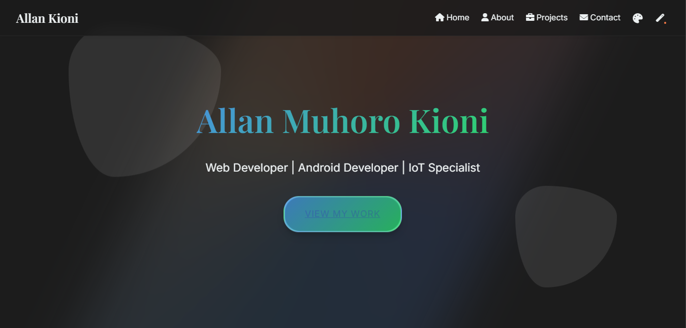

# Allan Kioni - Portfolio Website



A modern, interactive, and responsive portfolio website showcasing my skills, projects, and professional experience as a Web Developer, Android Developer, and IoT Specialist.

## 🚀 Live Demo

[View Live Site](https://allankioni.github.io/AllanKioni-Portfolio/)

## ✨ Features

- **Responsive Design**: Optimized for all devices (mobile, tablet, desktop)
- **Interactive Elements**: 3D hover effects, particle animations, and smooth transitions
- **Dark Mode + 5 Color Themes**: Multiple theme options for personalized browsing experience
- **Animated Book Component**: Creative book animation that opens on scroll
- **Project Filtering System**: Filter projects by category (Web, Android, IoT)
- **Animated Timeline**: Visually engaging professional journey section
- **Tech Stack Showcase**: Interactive display of technical skills with proficiency indicators
- **Particle Background**: Three interactive background animations (particles, matrix, waves)
- **Blog Section**: Latest insights with appealing card layouts
- **Contact Form**: Functional contact form for easy communication
- **Smooth Scrolling**: Enhanced navigation experience
- **Intersection Observer API**: For scroll-based animations and reveals

## 🛠️ Technologies Used

### Languages
- HTML5
- CSS3
- JavaScript (ES6+)

### Libraries & Frameworks
- [AOS (Animate On Scroll)](https://github.com/michalsnik/aos)
- [ScrollReveal](https://scrollrevealjs.org/)
- [Font Awesome](https://fontawesome.com/) (v6.0.0)

### Fonts
- [Playfair Display](https://fonts.google.com/specimen/Playfair+Display)
- [Inter](https://fonts.google.com/specimen/Inter)
- [Poppins](https://fonts.google.com/specimen/Poppins)

## 🎨 Design Elements

### Color Themes
- **Default**: Blue and teal gradients with light background
- **Tropical**: Vibrant orange and blue tones
- **Vintage**: Warm browns and amber accents
- **Natural**: Earth tones with green highlights
- **Cool**: Blue and purple tones
- **Dark**: Dark background with bright accents

### Animation Types
- Particle systems with interactive mouse tracking
- Matrix-style falling character effect
- Interactive wave animation

### UI Components
- 3D interactive buttons with light beam effects
- Animated cards with hover effects
- Interactive timeline
- Skill progress bars
- Animated book component
- Interactive tech tags
- Project showcase sections with feature highlights
- Blog cards with image hover effects
- Testimonial cards
- Floating geometric shapes
- Custom navigation with theme selector

## 📂 Project Structure

```
portfolio-website/
├── index.html                # Main HTML document
├── styles.css                # Main stylesheet
├── js/
│   └── main.js               # JavaScript functionality
├── images/                   # Image assets
│   ├── brave_screenshot_localhost.png
│   ├── eco-recyco.jpg
│   ├── gesture-guard.jpg
│   ├── smart-home.jpg
│   └── ...
├── CV.pdf                    # Downloadable CV
└── README.md                 # Documentation
```

## 🔧 Key JavaScript Features

- Theme management system with localStorage persistence
- 3D interactive button effects with parallax and lighting
- Canvas-based background animations with three modes
- Project and tech stack filtering system
- Book animation using Intersection Observer
- Contact form handling
- Mobile menu toggle
- Scroll-based animations and reveals
- Timeline animation
- Blog article link handling

## 🎭 CSS Techniques

- CSS Variables for theming
- Gradient backgrounds and borders
- Keyframe animations
- Pseudo-elements for decorative features
- Flexbox and Grid layouts
- Media queries for responsive design
- CSS transitions for smooth effects
- Box shadows and backdrop filters
- Hover and active state animations
- Dark mode optimizations

## 📱 Responsive Breakpoints

- Mobile: Up to 480px
- Tablet: 481px to 768px
- Small Desktop: 769px to 992px
- Desktop: 993px and above

## 🔍 SEO Considerations

- Semantic HTML structure
- Proper heading hierarchy
- Alt text for images
- Meta tags for description and viewport
- Proper link attributes

## 🚀 Performance Optimizations

- Deferred JavaScript loading
- Optimized image assets
- Minimal external dependencies
- Event delegation for better performance
- Conditional rendering of animations
- Reduced layout shifts

## 🔄 Version History

- **v1.0.0** - Initial release
- **v1.1.0** - Added dark mode and multiple themes
- **v1.2.0** - Implemented interactive background animations
- **v1.3.0** - Added project filtering system
- **v1.4.0** - Integrated blog section
- **v1.5.0** - Enhanced mobile responsiveness

## 🤝 Contact

Feel free to reach out for any questions or collaboration opportunities:

- **Email**: kioniallan@gmail.com
- **LinkedIn**: [allankioni](https://linkedin.com/in/allankioni)
- **GitHub**: [allankioni](https://github.com/allankioni)
- **Twitter**: [allankioni](https://twitter.com/allankioni)
- **Whatsapp**: [+254 741 235450](https://api.whatsapp.com/send?phone=254741235450)

## 📄 License

This project is licensed under the MIT License - see the LICENSE file for details.

---

Designed and developed by Allan Muhoro Kioni © 2024 
